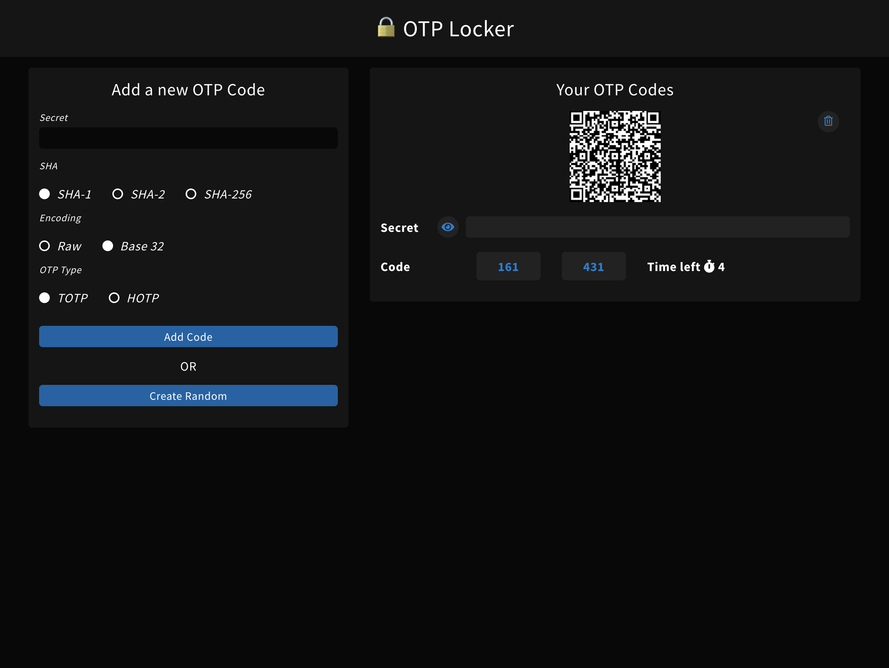

# OTP Locker


🔒 Manage your TOTP/HOTP keys via a webapp or electron based GUI



## Running for development

```bash
# install node modules
yarn # or npm install

# run dev server
ng serve --port 4200

# build for prod
ng build --prod

# deploy to gh-pages
ng run WebApp:deploy

# run tslint
yarn lint

# run sass-lint
yarn sass-lint
```

## Compiling for Electron

```bash
# install electron
yarn global add electron

# Build production
ng build --prod

# Run electron
electron .
```

## Got issues?

I'll be monitoring issues. Feel free to open any if you have them.